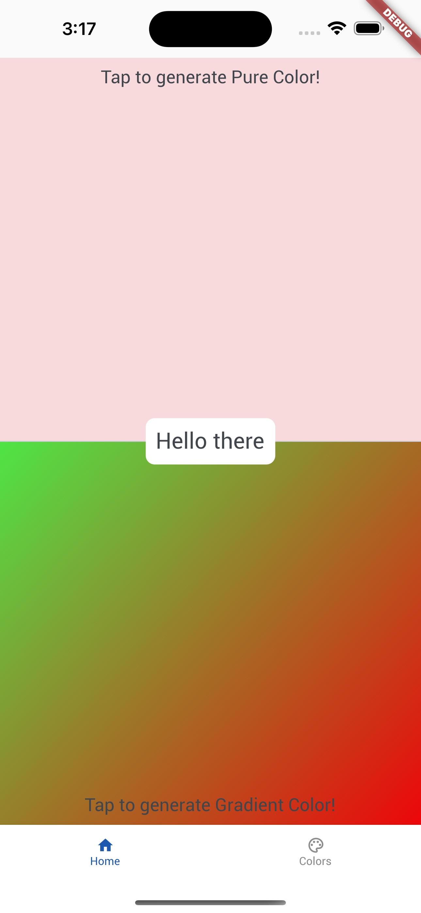
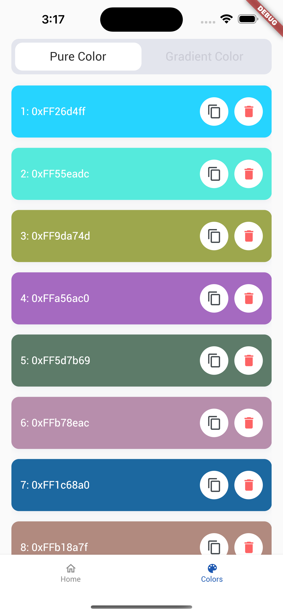
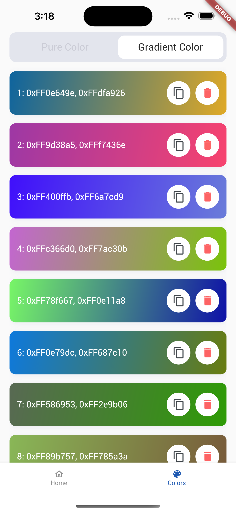

# Solid Software

Solid Software is a simple and interactive mobile application that allows users to generate random background colors by clicking anywhere on the screen. The app provides two sections for generating pure colors and gradient colors, enhancing the user experience. Additionally, users can view and copy the generated color codes from the Colors page.

## Features

- Click anywhere on the screen to generate a new background color.
- Two sections for generating pure colors and gradient colors.
- View the generated color code on the Colors page and copy it if desired.
- Splash screen and onBoarding for a visually appealing introduction.

## Table of Contents

1. [Getting Started](#getting-started)
2. [Screenshots](#screenshots)
3. [Dependencies](#dependencies)
4. [How to Use](#how-to-use)
5. [Testing](#testing)
6. [Linting](#linting)


## Getting Started

To get started with the Solid Software App, follow these steps:

1. Clone the repository: `git clone https://github.com/A-Eric-J/Solid-Software.git`
2. Change into the project directory: `cd Solid-Software`
3. Ensure you have Flutter installed on your machine.
4. Run the app on an emulator or physical device using `flutter run`.

## Screenshots



## Dependencies

The Solid Software App relies on the following dependencies:

- `flutter`: The core Flutter framework.
- `provider`: Used for state management to update the background color and bottom navigation state.
- `responsive_framework`: To create stunning and adaptive UIs that work seamlessly across a wide range of devices. With its responsive layout and adaptive design capabilities.
- `shared_preferences`: For saving onBoarding state to show it just one time.
- `get_it`: A great Service Locator for managing NavigationService.

All dependencies are listed in the `pubspec.yaml` file, and you can install them by running `flutter pub get`.

## How to Use

1. Launch the app on your device or emulator.
2. On the Home screen, you will find a blank area in the middle of the page.
3. Click anywhere on the screen to generate a new background color.
4. To view the generated color code, navigate to the Colors page.
5. Use the toggle buttons to switch between generating pure colors and gradient colors.
6. To copy the color code, simply tap on the code, and it will be copied to your clipboard.
7. Explore the app, enjoy the vibrant colors, and create your color palette!

## Testing

The Solid Software App has been thoroughly tested to ensure a smooth and bug-free experience. We have included unit tests and widget tests to cover various aspects of the app's functionality. To run the tests, execute the following command:

```
flutter test
```

## Linting

We have used `solid_lints` to ensure that our codebase adheres to best practices and coding standards. The linter rules are defined in the `analysis_options.yaml` file. To run the linter and check your code for potential issues, use the following command:

```
flutter analyze
```


Thank you for using the Solid Software App! We hope you enjoy using it as much as we enjoyed creating it. If you encounter any issues or have any suggestions, please feel free to open an issue on the repository. 

Happy coloring!